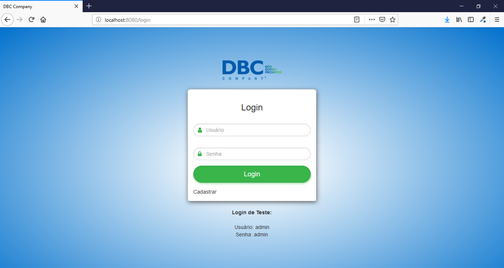
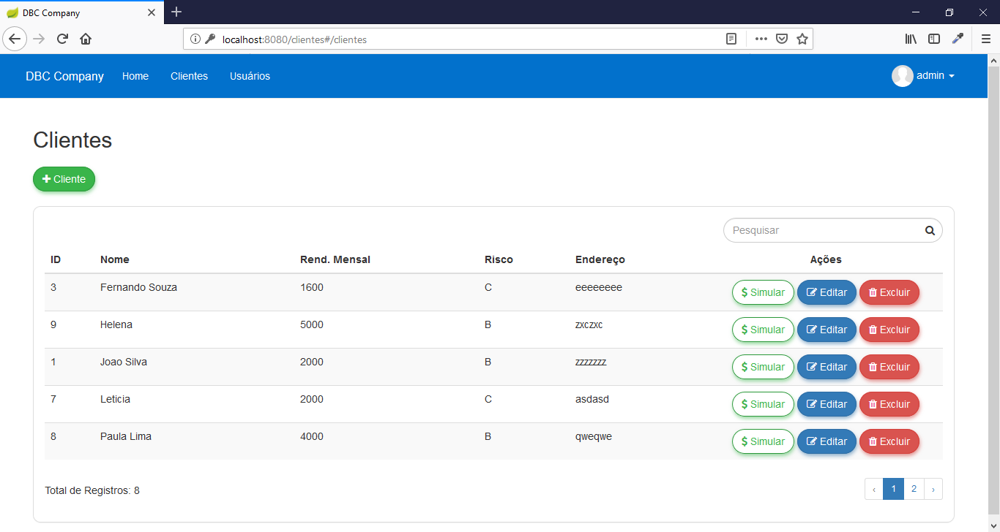
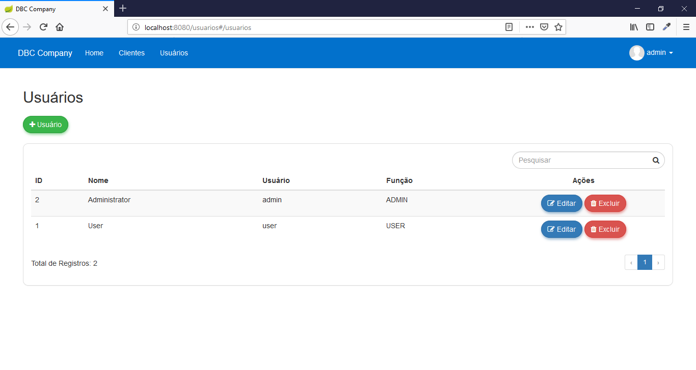
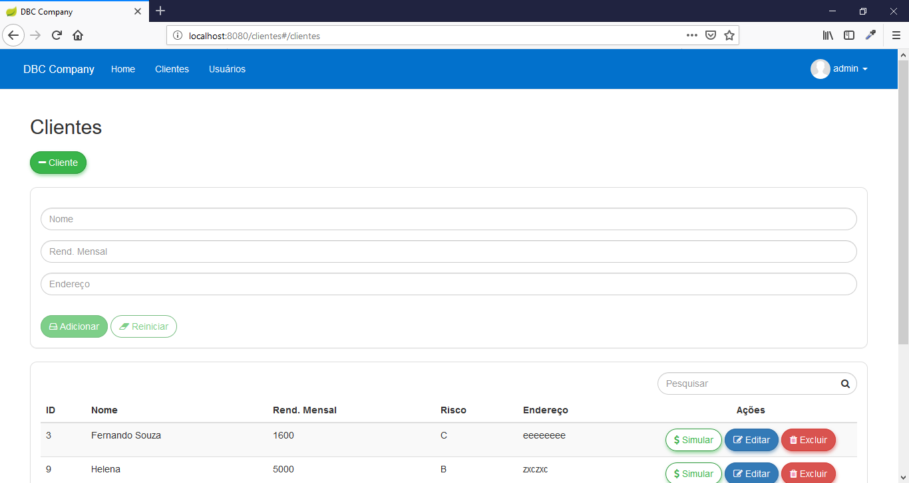
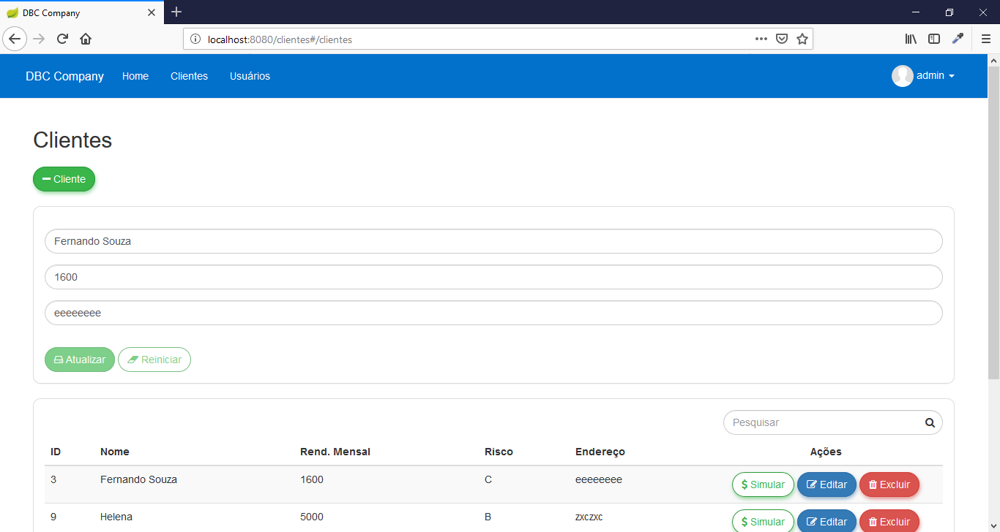
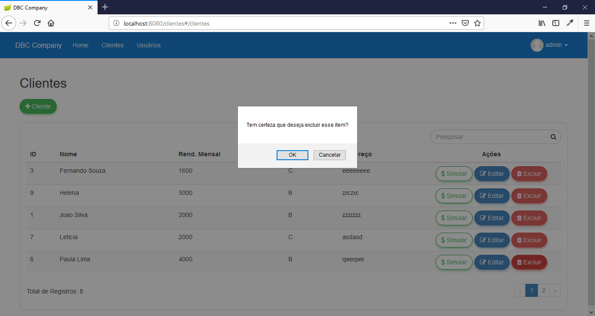
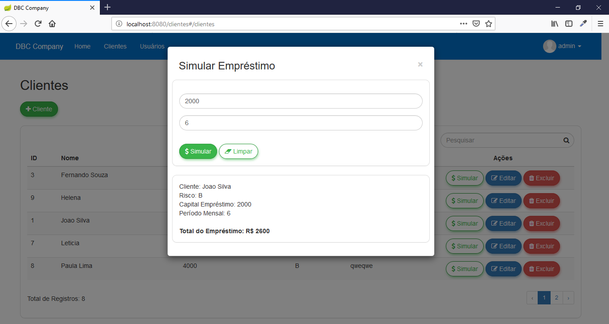
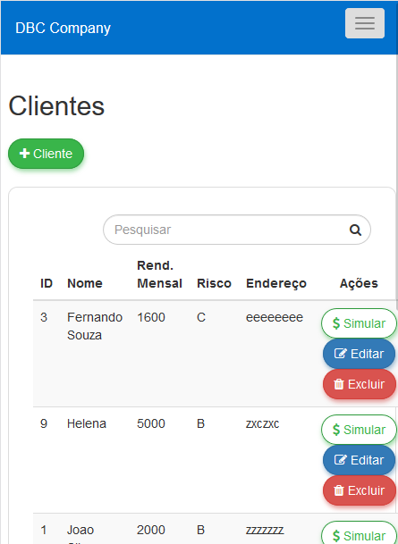
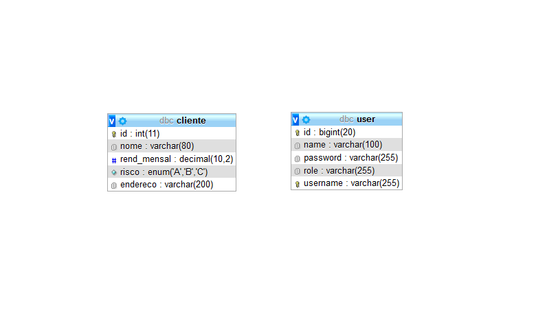

# Simulador de Empréstimo

Projeto de um simulador de empréstimo para clientes, desenvolvido em Java com Spring-Boot.

## Características

- CRUD
- API RESTful
- ACL
- Validation
- Filter
- Pagination
- Login
- Responsive
- JUnit

## Requisitos

- Java JDK 1.8
- Apache Maven >= 3.5.4
- MySql >=5

## Tecnologias

- Java
- JPA
- Maven
- Spring
- Swagger
- CSS
- Jquery
- Bootstrap
- AngularJS
- MySql

## Screenshots

  
  
  
  
  
  
  
  

## Modelo ER

  

Desenvolvidor 
Wallace Oliveira, Jeyvison Barnabé 
wallace.jesus@hotmail.com 
https://github.com/Merlutra 
